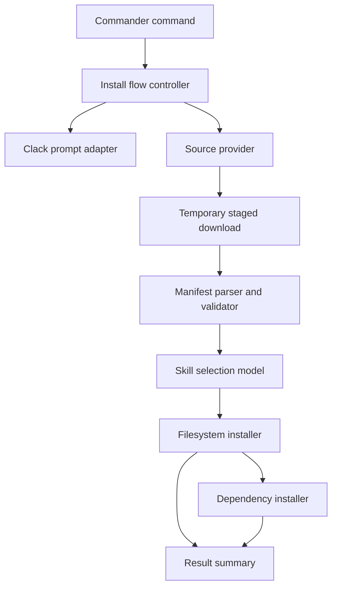
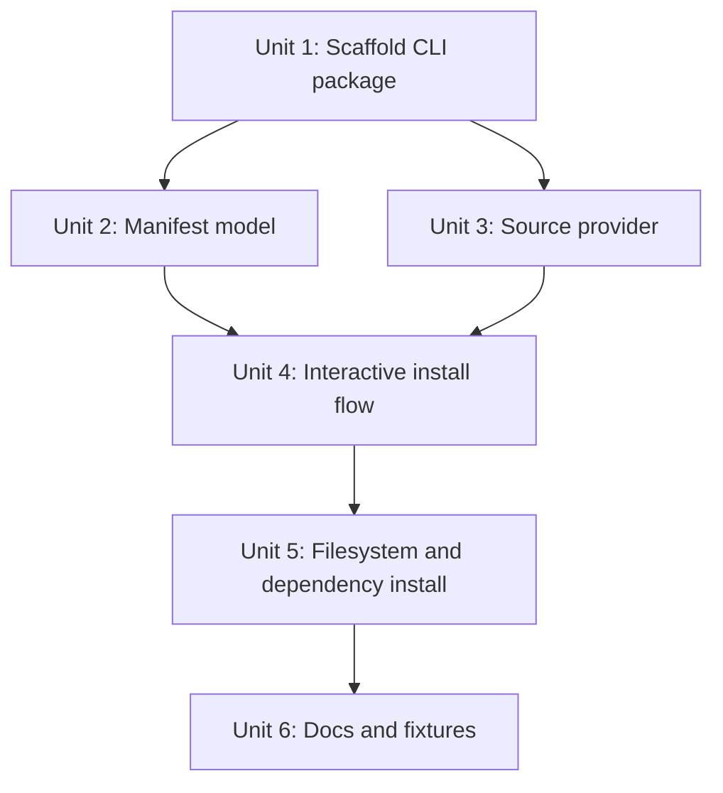

# feat: Build npm-style skills installer CLI

## Overview

Build a Node.js CLI that follows the installation pattern now common across many npm-distributed developer tools and skill-related packages: command entry via `npx` or an installed bin, lightweight terminal interaction, remote pack acquisition, selectable installable units, safe file installation into a target skills directory, optional dependency install, and clear completion output.

The proposed dependency direction is mostly sound, but the installer should not treat a specific visual style as the product. The broader pattern is an npm-native install flow where UI reduces friction while the stable core remains a manifest-driven installer with safe filesystem boundaries and a pluggable remote source provider. `@clack/prompts`, `picocolors`, and `figlet` shape the experience; the install engine, manifest validation, rollback behavior, and tests make it reliable.

## Problem Frame

The user is describing a broader npm ecosystem pattern, not a one-off clone of a particular tool. Many modern developer-tool and skill-package installers converge on the same shape: run a CLI, fetch or resolve a remote pack, present choices, install selected content, and optionally run package-manager work afterward.

The initial dependency list focuses on the right categories: prompt UI, command parsing, remote download, filesystem operations, and child process execution. The planning risk is that a familiar interactive flow can still behave badly if it copies unvalidated directories, installs arbitrary dependencies without consent, or cannot recover from partial writes.

This plan starts from an empty repository, so there are no local implementation patterns to preserve. It defines a conservative CLI architecture that keeps UX, source acquisition, manifest parsing, installation, and dependency execution separate.

## Requirements Trace

- R1. Provide a modern npm-style CLI interaction layer with intro/outro, spinner progress, multiselect, cancellation handling, and colored status output.
- R2. Support command shapes such as `skills add <source>`, plus an interactive default flow suitable for `npx` usage.
- R3. Resolve skill packs from registry entries, URLs, local paths, or GitHub-compatible sources without requiring users to manage git history.
- R4. Discover installable skills from downloaded content through a manifest or package metadata instead of ad hoc directory guessing.
- R5. Copy selected skills into a target skills directory safely, preserving existing user files unless overwrite is explicit.
- R6. Optionally run dependency installation after copying when a selected skill declares package dependencies.
- R7. Keep dependency and source execution boundaries explicit so remote content does not silently run code.
- R8. Include focused tests for CLI parsing, prompt flow decisions, manifest validation, source fetching abstraction, filesystem install behavior, and dependency execution decisions.

## Scope Boundaries

- This plan covers building the local CLI package and installer engine, not publishing to npm.
- This plan does not define the final brand name, exact ASCII art content, or a public skill registry service.
- This plan does not attempt to clone one vendor's visual identity; it implements the general npm skill-installer flow used by many packages.
- This plan does not implement a GUI, web catalog, or background updater.
- This plan does not auto-execute arbitrary postinstall scripts from downloaded skills beyond an explicit dependency install step controlled by the CLI.
- This plan assumes Node.js and TypeScript unless implementation discovers a strong reason to stay JavaScript-only.

## Context & Research

### Relevant Code and Patterns

- Repository scan found no existing source files, manifests, tests, or documentation in the project root.
- `docs/brainstorms/` does not exist, so there is no upstream requirements document.
- `docs/solutions/` does not exist, so no institutional learnings apply.
- `AGENTS.md` guidance from the prompt requires repo-relative file paths in planning artifacts and no code execution during planning.

### External References

- `@clack/prompts` supports grouped prompts, intro/outro, spinner, multiselect, and cancellation helpers suitable for the npm-style installer flow.
- `picocolors` supports lightweight terminal coloring with color support detection, useful for status text that degrades cleanly in non-color terminals.
- `figlet` can render branded ASCII art for TTY startup banners, but it should be optional presentation rather than an install-flow dependency.
- Commander.js supports subcommands, arguments, options, version metadata, and action handlers for command structures like `skills add <source>`.
- Execa supports subprocess execution with inherited output, captured output, and structured error handling for dependency installation.
- `degit` can download repository content without git history, matching the user's proposed distribution model.
- `giget` is a stronger candidate for the default source provider if the installer needs template registries, multiple git hosts, offline cache, authentication, or integrated package-manager install behavior.
- `fs-extra` remains useful for install-time operations such as ensuring directories, copying trees, and reading JSON manifests, but path validation must happen before `fs-extra` receives source or destination paths.

### Ecosystem Precedents

- `create-t3-app` confirms the mature scaffold pattern: npm/pnpm/yarn/bun create entry, interactive command prompts, and a dependency mix that includes `@clack/prompts`, Commander.js, Execa, and fs-extra.
- `shadcn` is the closest analogue for skill installation: `add` accepts component names, URLs, or local paths; it has `--yes`, `--overwrite`, `--cwd`, `--all`, `--path`, and `--silent`; it also exposes `search`, `list`, `view`, and `build` around a registry model.
- `astro add` confirms the integration-install variant: the CLI installs a published package, handles peer dependencies, and modifies `astro.config.*` so the installed unit is wired into the host project.
- Vercel AI SDK is relevant to installed skill runtime compatibility, not to the installer itself. If this project installs AI skills, the manifest can declare adapters or examples for `ai` tool definitions, but the installer core should not depend on the `ai` package unless it also executes skills.

### Technology & Infrastructure

- Target runtime: Node.js CLI package.
- Target language: TypeScript.
- Package manager: npm-compatible package with room for pnpm/yarn detection during implementation.
- Test framework: Vitest is recommended because the repo is empty and the work is TypeScript/Node-focused.
- Distribution surface: executable bin entry in `package.json`.

## Key Technical Decisions

| Decision | Rationale |
|---|---|
| Ship v1 as a complete installer, not a full ecosystem platform | v1 should include registry-backed discovery, add/view/list/search/remove, dry-run/diff, and dependency prompts, but defer signatures, private registry auth, updates, and automatic config mutation. |
| Fix v1 manifest filename to `skills.json` | A single filename keeps pack authoring and lookup simple while schema evolution can happen through `schemaVersion`. |
| Use static JSON registries for v1 | Static registries are easy to host, test, cache later, and mirror the shadcn-like model without requiring a registry service. |
| Require `--target` unless project config exists | Guessing Codex, Claude, or custom agent locations would be product behavior. `skills init` can save a project config, otherwise add/remove commands must receive an explicit target. |
| Treat config mutation as instructions in v1 | Adapter-specific config writes can damage user environments. v1 may display config instructions from metadata, but it should not rewrite Codex, Claude, MCP, or AI SDK configs. |
| Use `@clack/prompts` for interaction | It directly covers the desired intro, spinner, multiselect, grouped prompts, and cancellation flow with less UI code than lower-level prompt libraries. |
| Use `picocolors` and `figlet` as presentation helpers only | Colors and ASCII art help produce the familiar npm installer feel, but they must degrade cleanly in non-TTY, no-color, CI, and quiet modes. |
| Use Commander.js for command routing | It gives stable command parsing for `skills add <source>`, `skills list`, `skills install`, and future non-interactive flags. |
| Use a registry/manifest-first distribution model | The strongest analogue is `shadcn`: discover entries from a registry or manifest, then materialize source into the user's project. Raw GitHub folder copying is a provider option, not the product model. |
| Use a source-provider abstraction with `giget` as the v1 remote provider | `degit` fits the simple GitHub template case, but `giget` better matches a skills ecosystem if registry lookup, auth, offline cache, or multiple providers matter. A provider boundary lets the project choose one default without coupling installer logic to it. |
| Use manifest-driven skill discovery | A manifest gives predictable names, descriptions, dependencies, compatibility metadata, and install roots; directory-name inference is too brittle for a tool that copies files into user-owned skill directories. |
| Make dependency install explicit and inspectable | Running package-manager commands after downloading remote content crosses a trust boundary. Users should see what will run and be able to skip it. |
| Disable dependency lifecycle scripts by default when practical | Package installs can run lifecycle scripts. The safer default is to install declared dependencies without lifecycle scripts unless the user explicitly opts into script execution for a trusted source. |
| Prefer transactional file install behavior | The installer should stage downloaded content and copy selected skills only after validation, reducing partial-write and overwrite risks. |
| Treat non-TTY mode as a first-class path | `npx` usage is often interactive, but CI, scripted installs, and agent-driven installs need deterministic flags, no figlet-only output assumptions, and no required terminal rendering. |

## Open Questions

### Resolved During Planning

- What is the v1 scope? Build a complete local installer with registry discovery and safe install planning, but defer signatures, private registry auth, updates, and automatic config mutation.
- What is the v1 manifest filename? `skills.json`.
- What registry format should v1 support? Static JSON documents from local paths or HTTP(S) URLs.
- What default target should v1 use? No guessed default. Use `.skillsrc.json` from `skills init` or require `--target`.
- Should `degit` be the only remote-fetch implementation? No. It is acceptable as an initial provider for the exact dependency list the user proposed, but `giget` should be evaluated as the default because it already models template registries, multiple providers, cache behavior, and auth.
- Should the project copy shadcn's model more than create-t3-app's model? Yes. `create-t3-app` is a scaffold generator precedent; `shadcn` is the closer match because it installs named source units into an existing project from a registry-like source.
- Should Vercel AI SDK be a direct installer dependency? No. It is a likely runtime target for AI skills, but installer core should stay runtime-agnostic and let installed skill packs declare adapter compatibility.
- Should `figlet` be core? Yes, but only for branding. The CLI must still work in non-TTY or compact modes where large ASCII art is skipped.
- Should install run `npm install` automatically? Only after explicit confirmation or a non-interactive flag. Silent execution after remote download is too risky.
- Should dependency lifecycle scripts run by default? No. The installer should prefer script-disabled dependency installs and require an explicit trust/allow-scripts choice when a skill needs lifecycle scripts.
- Should config mutation happen automatically in v1? No. v1 displays adapter instructions and metadata only.

### Deferred to Implementation

- Exact manifest filename and schema details: define during implementation after deciding whether skill packs should align with existing Codex/Claude skill metadata or use a project-specific `skills.json`.
- Exact default target directory: depends on the tool's intended ecosystem, for example Codex skills, Claude skills, or a custom local directory.
- Exact package-manager detection strategy: implementation should inspect local lockfiles and environment behavior before finalizing npm/pnpm/yarn handling.
- Exact update semantics: deferred until installed-state tracking and source ref pinning have real usage.

## High-Level Technical Design

> *This illustrates the intended approach and is directional guidance for review, not implementation specification. The implementing agent should treat it as context, not code to reproduce.*

The core design keeps terminal prompts replaceable. Non-interactive flags should call the same install flow with preselected inputs instead of duplicating logic inside command handlers.

## Implementation Units

- [ ] **Unit 1: Scaffold CLI package and command surface**

**Goal:** Establish a TypeScript Node CLI package with executable command routing and test scaffolding.

**Requirements:** R1, R2, R8

**Dependencies:** None

**Files:**
- Create: `package.json`
- Create: `tsconfig.json`
- Create: `src/cli.ts`
- Create: `src/commands/add.ts`
- Create: `src/commands/list.ts`
- Create: `src/index.ts`
- Create: `test/cli.test.ts`

**Approach:**
- Define the CLI entry as a thin Commander.js layer that delegates to command modules.
- Keep command handlers free of prompt and filesystem implementation details.
- Include global options for target directory, non-interactive mode, and verbosity.
- Treat the default command as an interactive installer path suitable for `npx`.

**Patterns to follow:**
- Commander.js subcommands with action handlers.
- TypeScript ESM package layout unless package constraints require CommonJS.

**Test scenarios:**
- Happy path: invoking `skills add <source>` passes the source argument and parsed options to the add command handler.
- Happy path: invoking the default command without a subcommand enters the interactive add flow.
- Edge case: unknown command returns a useful command error without invoking installer logic.
- Edge case: `--target` accepts a custom directory and passes it through unchanged.
- Error path: command handler rejection is surfaced as a non-zero CLI failure with a concise message.

**Verification:**
- Command parsing is covered by tests without depending on live prompts or network access.

- [ ] **Unit 2: Define manifest schema and skill discovery**

**Goal:** Parse staged skill pack content into validated installable skill options.

**Requirements:** R4, R7, R8

**Dependencies:** Unit 1

**Files:**
- Create: `src/manifest/schema.ts`
- Create: `src/manifest/read.ts`
- Create: `src/manifest/types.ts`
- Create: `test/manifest.test.ts`
- Create: `test/fixtures/skill-pack-basic/`
- Create: `test/fixtures/skill-pack-invalid/`

**Approach:**
- Define a manifest with skill id, display name, description, source path, install path behavior, dependencies, and optional compatibility metadata.
- Validate all file paths as relative paths inside the staged directory.
- Treat missing descriptions or names as validation errors rather than silently installing unclear entries.
- Support deriving display metadata from existing skill files only as a fallback when the manifest explicitly allows it.

**Patterns to follow:**
- Schema-first validation with typed output consumed by downstream installer logic.

**Test scenarios:**
- Happy path: a valid manifest with two skills returns two selectable entries with names, descriptions, and source paths.
- Edge case: an empty skills array fails validation with a specific manifest error.
- Edge case: a skill source path that escapes the staged directory is rejected.
- Error path: malformed JSON or YAML returns a user-facing validation error and does not produce partial options.
- Integration: staged fixture content plus manifest parser produces install candidates consumed by the install flow model.

**Verification:**
- Invalid remote content cannot reach the filesystem installer as trusted install input.

- [ ] **Unit 3: Add remote source provider and staging layer**

**Goal:** Fetch GitHub-compatible skill packs into a temporary staging directory behind a provider interface.

**Requirements:** R3, R7, R8

**Dependencies:** Unit 1

**Files:**
- Create: `src/source/provider.ts`
- Create: `src/source/degit-provider.ts`
- Create: `src/source/local-provider.ts`
- Create: `src/source/staging.ts`
- Create: `test/source-provider.test.ts`

**Approach:**
- Define a provider contract that resolves a source string into a staged local directory.
- Implement a local provider for tests and offline development.
- Implement an initial GitHub/template provider using `degit` only if the product needs the smallest possible dependency surface; otherwise prefer `giget` for registry, auth, cache, and multi-provider support.
- Support a registry entry source shape before or alongside raw repository sources, so the CLI can grow toward `search`, `list`, and `view` without changing installer internals.
- Normalize supported source formats and reject ambiguous values before fetching.
- Encourage explicit refs for remote sources where the provider supports them, so users can pin a branch, tag, or commit instead of always tracking a moving default branch.
- Clean staging directories after success or failure unless debug mode asks to preserve them.

**Patterns to follow:**
- Provider pattern with dependency injection for testability.
- Temporary directory staging before validation and install.

**Test scenarios:**
- Happy path: local fixture provider stages a skill pack and returns a readable directory.
- Happy path: provider selection chooses remote provider for GitHub-style source input.
- Happy path: configured registry source resolves through the selected provider without changing manifest parsing or installer behavior.
- Happy path: source with an explicit ref is passed to the provider and reflected in the install summary.
- Edge case: unsupported source format fails before creating install output.
- Edge case: offline/prefer-offline mode uses cached content only when the selected provider supports it, and otherwise returns a clear unsupported-mode error.
- Error path: provider download failure produces a clear source acquisition error.
- Error path: staging cleanup runs after failed manifest validation.

**Verification:**
- Installer tests can run without live network access, while the remote provider remains isolated enough for a later integration test.

- [ ] **Unit 4: Build interactive and non-interactive install flow**

**Goal:** Orchestrate source acquisition, manifest discovery, skill selection, confirmation, cancellation, and summary output through a reusable flow controller.

**Requirements:** R1, R2, R4, R6, R7, R8

**Dependencies:** Unit 2, Unit 3

**Files:**
- Create: `src/flow/install-flow.ts`
- Create: `src/ui/prompts.ts`
- Create: `src/ui/theme.ts`
- Create: `test/install-flow.test.ts`
- Create: `test/prompt-adapter.test.ts`

**Approach:**
- Wrap `@clack/prompts` behind a prompt adapter so core flow tests can supply fake selections.
- Use `intro`, `spinner`, `multiselect`, confirmation prompts, `cancel`, and `outro` for interactive TTY mode.
- Skip figlet output in non-TTY mode, CI, or explicit quiet mode.
- Require explicit confirmation before dependency installation unless a trusted non-interactive flag is provided.
- Maintain one flow controller for both interactive and non-interactive execution.

**Patterns to follow:**
- Clack grouped prompts and cancellation handling.
- Thin UI adapter over pure flow decisions.

**Test scenarios:**
- Happy path: user selects two skills, confirms install, and receives an install request for both skills.
- Happy path: non-interactive input preselects a named skill and bypasses prompt calls.
- Edge case: user cancels at skill selection and no source content is installed.
- Edge case: no skills match non-interactive selection and the flow fails before filesystem writes.
- Error path: manifest validation error stops the spinner and displays a clear failure state.
- Integration: source provider, manifest parser, fake prompt adapter, and installer adapter receive calls in the expected order.

**Verification:**
- Prompt behavior is testable without snapshotting fragile terminal control sequences.

- [ ] **Unit 5: Implement safe filesystem install and dependency execution**

**Goal:** Copy selected skills to the target directory with overwrite protection, rollback-aware staging, and optional package dependency installation.

**Requirements:** R5, R6, R7, R8

**Dependencies:** Unit 4

**Files:**
- Create: `src/install/filesystem-installer.ts`
- Create: `src/install/dependency-installer.ts`
- Create: `src/install/plan.ts`
- Create: `test/filesystem-installer.test.ts`
- Create: `test/dependency-installer.test.ts`

**Approach:**
- Build an install plan before writing files, including target paths, conflict status, and dependency actions.
- Reject path traversal and absolute install paths.
- Default to no overwrite; require explicit overwrite confirmation or flag.
- Copy into a temporary destination or staged target before finalizing where practical.
- Use Execa for dependency commands with inherited output in interactive mode and captured output in test/non-interactive mode.
- Make dependency install opt-in when remote content declares dependencies.
- Prefer dependency installation with lifecycle scripts disabled; require explicit user confirmation or flag before allowing scripts for a trusted source.

**Patterns to follow:**
- Plan-then-apply filesystem workflows.
- Execa subprocess execution with controlled stdout/stderr behavior.

**Test scenarios:**
- Happy path: selected skill directory copies into an empty target directory.
- Happy path: declared dependencies produce a dependency install action after confirmation.
- Happy path: dependency install plan defaults to scripts-disabled mode and records when script execution is explicitly allowed.
- Edge case: target skill already exists and overwrite is false, so installation is blocked before writing.
- Edge case: target path traversal attempt is rejected before filesystem access.
- Error path: copy failure reports the failed skill and leaves unrelated selected skills unmodified where rollback is possible.
- Error path: dependency command failure marks install as incomplete and includes the command failure summary.
- Integration: install plan generation plus apply step preserves existing target files by default.

**Verification:**
- Filesystem operations never write outside the configured target directory in tests.

- [ ] **Unit 6: Add user-facing documentation and sample skill pack**

**Goal:** Document usage, trust boundaries, supported source formats, and authoring rules for skill packs.

**Requirements:** R2, R3, R4, R6, R7

**Dependencies:** Unit 5

**Files:**
- Create: `README.md`
- Create: `docs/skill-pack-format.md`
- Create: `docs/registry-format.md`
- Create: `examples/basic-skill-pack/`
- Create: `test/readme-examples.test.ts`

**Approach:**
- Explain interactive usage, direct `skills add <source>` usage, target directory configuration, overwrite behavior, and dependency install prompts.
- Document the manifest, registry entry format, and path safety rules.
- Provide a minimal sample pack that can be used by tests and local demos.
- Include a note that remote skill packs should be treated as code from a third party.

**Patterns to follow:**
- README-first CLI documentation with examples that match tested behavior.

**Test scenarios:**
- Happy path: documented sample command maps to a supported CLI command shape.
- Happy path: example skill pack validates under the manifest schema.
- Edge case: README examples do not depend on a live network source.

**Verification:**
- A new contributor can understand how to run, test, and author a skill pack from repository documentation.

## System-Wide Impact

- **Interaction graph:** CLI command handlers call the flow controller; the flow controller calls prompt, source, manifest, installer, and dependency adapters.
- **Error propagation:** Provider, manifest, install, and dependency errors should become typed user-facing errors at the flow boundary; stack traces should be debug-only.
- **State lifecycle risks:** Staged downloads, partial filesystem copies, existing target files, and dependency install failures are the main state risks.
- **API surface parity:** Interactive and non-interactive modes must share the same install engine so CI usage and human TTY usage do not diverge.
- **Integration coverage:** Cross-layer tests should prove source acquisition, manifest parsing, selection, install planning, and dependency decision ordering.
- **Unchanged invariants:** Remote content is copied only after validation; existing user files are preserved by default; dependency commands are not run silently.

## Risks & Dependencies

| Risk | Mitigation |
|------|------------|
| Remote source executes or installs untrusted content unexpectedly | Separate fetch/copy from dependency install; require confirmation for commands; document trust boundary. |
| Package-manager lifecycle scripts execute code during dependency install | Prefer script-disabled installs by default; require explicit allow-scripts consent for trusted sources. |
| Remote source authenticity changes between runs | Support explicit source refs where available; show source and ref in summary; document that unsigned remote sources are not integrity-verified in v1. |
| `degit` package maintenance or behavior becomes limiting | Keep source provider abstraction and local provider tests; prefer `giget` if registry, auth, offline cache, or multiple git hosts are required. |
| Prompt tests become brittle due terminal rendering | Test prompt adapter calls and flow decisions rather than raw ANSI output. |
| Partial writes leave target directory inconsistent | Build install plan first; avoid overwrite by default; stage or rollback where practical. |
| CLI works interactively but fails in CI/non-TTY | Include non-interactive flags and skip figlet/TTY-only effects in non-TTY mode. |
| Node toolchain on target machine is broken or missing | Validate runtime prerequisites early and surface actionable errors before remote fetch or file writes. |
| Manifest schema locks in too early and blocks compatibility with existing skill ecosystems | Keep the schema small for v1, document compatibility assumptions, and isolate schema normalization from install execution. |
| Installer couples too tightly to one AI runtime | Keep the installer runtime-agnostic; model Vercel AI SDK or other runtime support as skill-pack compatibility metadata. |

## Documentation / Operational Notes

- README should make the recommended install command explicit only after dependency choices are finalized.
- If the package is intended for `npx`, keep startup dependencies lean and avoid heavyweight transitive UI packages.
- Consider documenting both `degit` and an alternative downloader choice if implementation research shows `degit` is stale for needed source formats.
- Document the default dependency-install trust model, including whether lifecycle scripts are disabled and how a user opts into scripts for trusted packs.
- Record the default target directory only after the intended host ecosystem is confirmed.

## Sources & References

- User request: dependency and flow proposal for the npm-style installer pattern common in skill-related packages.
- Repository context: empty project root, no existing implementation patterns.
- create-t3-app repository: https://github.com/t3-oss/create-t3-app
- shadcn CLI documentation: https://ui.shadcn.com/docs/cli
- Astro integration documentation: https://docs.astro.build/en/reference/integrations-reference/#allow-installation-with-astro-add
- Vercel AI SDK documentation: https://vercel.com/docs/ai-sdk
- `@clack/prompts` documentation: https://github.com/bombshell-dev/clack
- Picocolors documentation: https://github.com/alexeyraspopov/picocolors
- Figlet.js documentation: https://github.com/patorjk/figlet.js
- Commander.js documentation: https://github.com/tj/commander.js
- Execa documentation: https://github.com/sindresorhus/execa
- Degit repository: https://github.com/Rich-Harris/degit
- Giget documentation: https://github.com/unjs/giget
- fs-extra documentation: https://github.com/jprichardson/node-fs-extra
