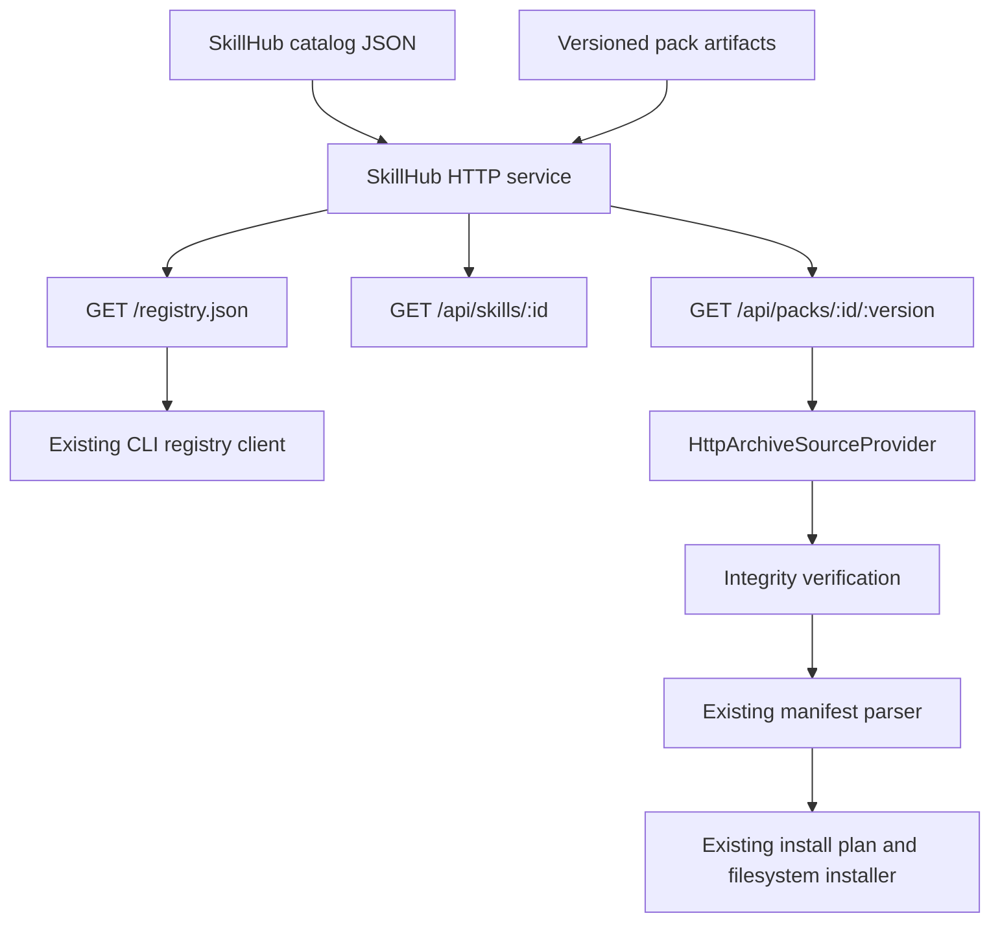
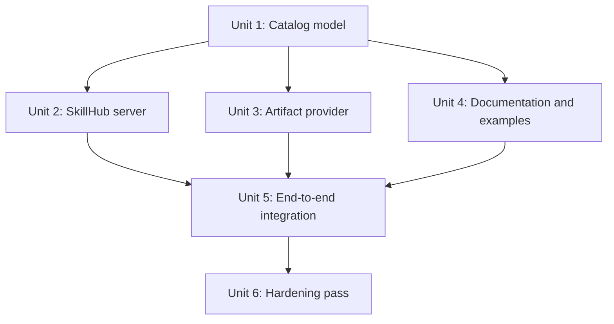

# feat: Add SkillHub MVP

## Overview

Add a deployable, read-only SkillHub service that publishes a hosted skill catalog and downloadable skill pack artifacts for the existing `modern-ref-pack` CLI. The service should make the current installer useful beyond local JSON files: teams can deploy a small server, browse a catalog through API endpoints, point the CLI at `/registry.json`, and install skills through the same safe local install flow.

The first version should stay deliberately small. SkillHub v1 is not a marketplace, auth system, publisher workflow, or web UI. It is a compatibility-first distribution layer: server-side catalog metadata plus artifact hosting, with enough CLI hardening to install those hosted artifacts safely.

## Problem Frame

The current CLI already supports the local half of a skills ecosystem: registry lookup, manifest validation, safe install planning, dry runs, file copying, and removal. It still depends on either local registries or remote sources that the CLI can resolve directly. A server-side SkillHub can become the stable discovery and distribution point while keeping the CLI responsible for local safety.

The main planning risk is scope creep. A full hub could include users, orgs, private registries, publish flows, signatures, reviews, update tracking, and a browser UI. Those are useful later, but they are not required to prove the end-to-end product shape. The MVP should prove one contract first: a hosted SkillHub registry can feed the existing CLI, and the CLI can install a hosted pack artifact with explicit validation and no silent code execution.

## Requirements Trace

- R1. Provide a deployable SkillHub HTTP service that exposes a hosted skills catalog.
- R2. Preserve compatibility with the existing CLI registry format through `GET /registry.json`.
- R3. Provide skill detail APIs for clients or future UI work without requiring a UI in this phase.
- R4. Serve versioned skill pack artifacts that the CLI can download and validate.
- R5. Extend the CLI source layer to install HTTP archive artifacts from SkillHub without relying on `giget` behavior for arbitrary URLs.
- R6. Add integrity metadata and verification for hosted artifacts before manifest parsing and filesystem install.
- R7. Keep v1 read-only: no login, private registry, publish command, update command, or automatic agent config mutation.
- R8. Bound HTTP artifact downloads and artifact serving so malformed or oversized hosted content cannot consume unbounded disk or escape the artifact root.
- R9. Cover the server, archive provider, registry compatibility, and CLI-to-SkillHub install path with focused tests.
- R10. Document deployment shape, catalog authoring, trust boundaries, and how users configure the CLI against a SkillHub deployment.

## Scope Boundaries

- SkillHub v1 is a read-only service backed by local catalog/artifact files.
- No user accounts, SSO, tokens, private registries, role-based access, or publishing workflow.
- No web UI. The service may expose JSON suitable for a future UI, but this plan does not build pages.
- No update/outdated command or installed-state tracking.
- No automatic config mutation for Codex, Claude, MCP, or other runtimes.
- No database requirement in v1. A file-backed catalog keeps deployment and tests simple.
- No cryptographic signature trust chain in v1. The MVP verifies artifact hashes from registry metadata, but does not establish author identity.
- No broad package-manager changes beyond preserving the current explicit dependency install model.

## Context & Research

### Relevant Code and Patterns

- `src/cli.ts` defines a thin Commander command surface that delegates to command modules.
- `src/registry/client.ts` already fetches HTTP(S) registries with `fetch`, parses them through `src/registry/schema.ts`, and exposes search/find helpers.
- `src/registry/types.ts` defines the current registry contract: `id`, `name`, `description`, `source`, optional `manifestPath`, `tags`, and `adapters`.
- `src/source/provider.ts` defines the `SourceProvider` / `SourceResolver` boundary that should absorb the new HTTP archive source behavior.
- `src/source/giget-provider.ts` currently claims `http:` and `https:` sources and delegates them to `giget`; SkillHub artifacts need a dedicated provider so archive handling and integrity checks are explicit.
- `src/manifest/schema.ts` and `src/paths.ts` already enforce safe relative paths inside skill packs.
- `src/install/plan.ts` and `src/install/filesystem-installer.ts` already separate planning from filesystem writes.
- `test/cli-smoke.test.ts` provides the pattern for a real CLI smoke test in an isolated temp directory.
- `docs/skill-pack-format.md` and `docs/registry-format.md` are the documentation surfaces to extend.
- `docs/plans/2026-04-27-001-feat-skills-installer-cli-plan.md` intentionally excluded a public registry service from the first installer milestone; this plan covers that deferred ecosystem layer.

### Institutional Learnings

- `docs/solutions/` does not exist, so there are no prior solution notes to reuse.

### External References

- Fastify official documentation supports TypeScript route declarations, JSON schema validation/serialization, and request testing with `inject`; during implementation, the MVP used a small Node built-in HTTP server with an app factory and `inject`-style test helper to avoid adding a server framework before the API surface needs it.
- The existing CLI already uses the built-in `fetch` API for HTTP registries, so the archive provider can avoid adding a general HTTP client dependency unless implementation finds a concrete need.

## Key Technical Decisions

| Decision | Rationale |
|---|---|
| Build SkillHub v1 as read-only | Proves discovery and hosted installation without pulling auth, publishing, moderation, and update state into the first server milestone. |
| Keep `/registry.json` compatible with current CLI shape | The server should be useful immediately to existing CLI commands; compatibility prevents a simultaneous server/client rewrite. |
| Add optional registry fields rather than replacing the contract | Fields such as `version`, `integrity`, `artifactType`, and `sizeBytes` can enrich hosted entries while older fields remain valid. |
| Serve versioned archive artifacts | A downloadable archive is a stable distribution unit for deployed servers and lets the CLI verify bytes before reading `skills.json`. |
| Use `.tgz` as the only v1 artifact type | A single archive format keeps provider behavior testable and avoids format negotiation. Zip and other formats can be added later if needed. |
| Use Subresource Integrity-style SHA-256 strings | `integrity` should use `sha256-<base64-digest>` so artifact verification has one documented format in v1. |
| Add a dedicated `HttpArchiveSourceProvider` before `GigetSourceProvider` | SkillHub artifact downloads should not depend on undocumented `giget` handling of arbitrary HTTP URLs. Provider order must keep archive URLs explicit. |
| Verify artifact integrity in the source provider | Integrity verification belongs before manifest parsing and install planning so corrupted or tampered bytes never reach the installer. |
| Require safe `.tgz` extraction | Integrity proves bytes match metadata, but it does not prove archive paths are safe. Extraction must reject absolute paths, parent traversal, links that escape the staging root, and unexpected file types before writing target files. |
| Use Node built-in HTTP for the SkillHub MVP | The v1 API is small and read-only. A minimal app factory avoids adding a framework dependency while preserving route-level tests and leaving room to adopt Fastify later if routing needs grow. |
| Use a file-backed catalog for v1 | A JSON catalog and local artifact directory keep deployment simple and make tests deterministic. A database can be introduced later without changing the CLI registry contract. |
| Keep catalog validation separate from registry parsing | Server catalog metadata will be richer than the CLI registry format; a projection step should produce CLI-compatible registry output. |
| Require a configured public base URL for registry projection | `/registry.json` must emit installable artifact URLs. Building them from request headers would make CLI behavior depend on proxy details. |
| Store artifact paths as server-local metadata | SkillHub catalog versions should store an `artifactPath` relative to the artifact root. `/registry.json` projection derives public artifact URLs from `publicBaseUrl`, preventing catalog authors from accidentally creating SSRF-like arbitrary download targets inside the hosted registry. |
| Require slugs for SkillHub ids and versions | Skill and version route params should be restricted to predictable slug/version characters. This avoids path-like identifiers and makes artifact lookup a catalog lookup, not a filesystem path operation. |
| Use a conservative default artifact size limit | The CLI and server should enforce a configurable maximum, with a small default appropriate for skill packs. Catalog `sizeBytes` cannot exceed that limit unless configuration explicitly raises it. |
| Keep service startup outside the existing CLI bin | `skills` remains the installer. SkillHub can have its own entry script and package scripts without changing the installer command surface. |

## Open Questions

### Resolved During Planning

- Should SkillHub v1 include login/private registries? No. Keep v1 read-only and public-by-deployment.
- Should SkillHub v1 include a web UI? No. JSON API and registry compatibility are enough for the first milestone.
- Should the server output a new registry format only? No. `/registry.json` should remain compatible with `src/registry/schema.ts`, with optional additive metadata handled by CLI schema updates.
- Should HTTP artifacts rely on `giget`? No. Add a dedicated provider so download, extraction, cleanup, and integrity errors are controlled by this project.
- Should integrity be mandatory? For SkillHub-hosted artifact entries, yes. Direct legacy registry entries can remain valid without integrity to preserve existing behavior.
- Should v1 use a database? No. File-backed catalog first; defer persistence complexity until publishing and private registries exist.
- Should artifact size limits be part of v1? Yes. Hosted artifact metadata should include `sizeBytes`, and the CLI should reject downloads that exceed declared or configured limits.
- What archive format should v1 support? `.tgz` only, with an explicit `artifactType: "tgz"` field for hosted artifacts.
- What integrity format should v1 support? `sha256-<base64-digest>` only, matching the common Subresource Integrity shape without adding multiple algorithms.
- Should SkillHub catalog entries store arbitrary public artifact URLs? No. Store server-local `artifactPath` relative to the artifact root and derive public URLs during registry projection.
- Should v1 support archive manifests nested under arbitrary top-level folders? No. SkillHub-hosted `.tgz` artifacts should expose `skills.json` at the archive root in v1. Existing non-SkillHub source providers can continue to honor `manifestPath`.

### Deferred to Implementation

- Exact artifact packing utility: v1 may use prepared fixture artifacts for tests, or add a small pack helper if needed to keep examples maintainable.
- Exact runtime config names: final environment variable names should be chosen while wiring the server entrypoint and docs.
- Exact deployment target: local Node hosting is sufficient for v1 docs; container or platform-specific deployment can be added later.

## High-Level Technical Design

> *This illustrates the intended approach and is directional guidance for review, not implementation specification. The implementing agent should treat it as context, not code to reproduce.*

SkillHub owns discovery metadata and artifact serving. The CLI continues to own local installation safety: resolving a source to a staged directory, validating `skills.json`, creating an install plan, refusing unsafe paths, and copying selected skills only after confirmation or `--yes`.

### MVP API Surface

| Endpoint | Purpose | Notes |
|---|---|---|
| `GET /health` | Deployment and smoke-check signal | Returns service status and catalog load status. |
| `GET /registry.json` | CLI-compatible registry | Projects richer catalog entries into `SkillsRegistry`. |
| `GET /api/skills` | Full catalog listing | Includes versions and metadata useful for future UI work. |
| `GET /api/skills/:id` | Skill detail | Returns one skill with latest version and available versions. |
| `GET /api/packs/:id/:version` | Artifact download | Serves the exact archive referenced by registry metadata. |

## Implementation Units

- [x] **Unit 1: Define SkillHub catalog and registry projection**

**Goal:** Add a server-side catalog model that can represent hosted skill versions and project them into the existing CLI registry format.

**Requirements:** R1, R2, R3, R4, R6, R8, R9

**Dependencies:** None

**Files:**
- Create: `src/skillhub/catalog/types.ts`
- Create: `src/skillhub/catalog/schema.ts`
- Create: `src/skillhub/catalog/read.ts`
- Create: `src/skillhub/catalog/registry-projection.ts`
- Modify: `src/registry/types.ts`
- Modify: `src/registry/schema.ts`
- Modify: `src/commands/view.ts`
- Test: `test/skillhub-catalog.test.ts`
- Test: `test/registry.test.ts`

**Approach:**
- Model SkillHub catalog entries separately from CLI registry entries so server metadata can include versions, artifact URLs, integrity, size, review status, and timestamps without forcing all CLI registries to provide those fields.
- Extend the CLI registry parser with optional additive fields needed for hosted artifacts, while preserving existing fixture compatibility.
- Update `view` output to display optional hosted metadata such as version and integrity when present, while keeping legacy registry entries concise.
- Make `registry-projection` the one place that converts SkillHub catalog data into the shape consumed by `readRegistry`.
- Project hosted entries with absolute artifact URLs built from configured SkillHub public base URL plus artifact route paths.
- Keep catalog artifact storage metadata separate from registry install metadata: catalog versions declare local `artifactPath`, while projection emits public `source` URLs.
- Treat duplicate skill ids, duplicate version ids, missing latest versions, and invalid artifact metadata as catalog validation errors.
- Validate SkillHub ids and versions as route-safe slugs or semver-like strings rather than accepting arbitrary path-like text.
- Keep catalog file paths and artifact references relative to the configured SkillHub data root unless explicitly modeled as public URLs.
- Require hosted catalog versions to declare `artifactType: "tgz"`, `integrity` in `sha256-<base64-digest>` form, and `sizeBytes` so server and CLI can enforce bounded download behavior.
- Require hosted `.tgz` artifacts to contain `skills.json` at archive root for v1; do not require the extractor or manifest reader to guess nested archive roots.

**Patterns to follow:**
- `src/registry/schema.ts` for schema-first validation with `UserError` messages.
- `src/manifest/schema.ts` for duplicate detection and optional metadata normalization.
- `test/registry.test.ts` for compact parser tests.

**Test scenarios:**
- Happy path: a catalog with one skill and one latest version projects to a valid registry entry with the expected `source`, `manifestPath`, tags, adapters, version, and integrity metadata.
- Happy path: a catalog with multiple versions marks the configured latest version in `/registry.json`.
- Happy path: `view` displays versioned hosted metadata when a registry entry includes it.
- Edge case: duplicate skill ids are rejected with a catalog validation error.
- Edge case: latest version points to a missing version and catalog loading fails.
- Edge case: existing minimal registry fixtures without version or integrity still parse successfully.
- Edge case: ids or versions containing slashes, backslashes, `..`, or URL-encoded path traversal are rejected by catalog validation and route tests.
- Error path: hosted artifact entries missing integrity are rejected by the SkillHub catalog parser.
- Error path: hosted artifact entries using unsupported `artifactType` values are rejected by the SkillHub catalog parser.
- Error path: hosted artifact entries using unsupported integrity algorithms or malformed digests are rejected by the SkillHub catalog parser.
- Error path: hosted artifact entries missing `sizeBytes` are rejected by the SkillHub catalog parser.
- Error path: hosted artifact entries whose `artifactPath` escapes the artifact root are rejected before route handlers can serve them.

**Verification:**
- Existing registry tests still pass.
- SkillHub catalog validation prevents invalid hosted metadata from reaching route handlers or CLI projection.

- [x] **Unit 2: Add the read-only SkillHub HTTP service**

**Goal:** Provide a deployable HTTP service that loads the catalog, serves API responses, and exposes a CLI-compatible `/registry.json`.

**Requirements:** R1, R2, R3, R4, R8, R9

**Dependencies:** Unit 1

**Files:**
- Modify: `package.json`
- Create: `src/skillhub/server/app.ts`
- Create: `src/skillhub/server/routes.ts`
- Create: `src/skillhub/server/config.ts`
- Create: `src/skillhub/server/entry.ts`
- Test: `test/skillhub-server.test.ts`

**Approach:**
- Add a small Node HTTP service and keep it buildable as part of the existing TypeScript project.
- Expose an app factory with an `inject`-style helper so tests can exercise routes without depending on a deployed service.
- Load catalog path, artifact root, and public base URL from explicit server config; do not infer from the CLI `.skillsrc.json`.
- Keep route handlers thin: catalog read/validation and registry projection live in catalog modules; artifact lookup lives in artifact modules.
- Serve artifacts only by resolving catalog entries, not by interpolating request params into filesystem paths.
- Serve v1 artifacts with `artifactType: "tgz"` and reject catalog entries that do not match the file and metadata constraints.
- Prefer route schemas for params and responses so path-like ids and malformed versions are rejected consistently.
- Emit stable headers for immutable versioned artifacts, while keeping `/registry.json` cache behavior conservative so catalog changes are visible.
- Return consistent JSON error bodies for missing skills, missing versions, invalid catalog state, and artifact lookup failures.
- Ensure `/registry.json` returns only fields the CLI schema understands or intentionally supports as additive optional fields.

**Patterns to follow:**
- `src/commands/*.ts` for thin entrypoints delegating to reusable modules.
- `src/errors/user-error.ts` for user-facing error semantics where reusable.
- The existing thin module pattern plus a local app factory and `inject`-style route test helper.

**Test scenarios:**
- Happy path: `GET /health` returns healthy status when the catalog loads.
- Happy path: `GET /registry.json` returns a `SkillsRegistry` object that `parseRegistry` accepts.
- Happy path: `GET /api/skills` returns the full skill list with latest version metadata.
- Happy path: `GET /api/skills/browser-agent` returns one skill detail.
- Edge case: unknown skill id returns 404 with a concise JSON error.
- Edge case: path-like ids or versions cannot escape the configured artifact root.
- Edge case: `/registry.json` projection uses configured public base URL, not `Host` or `X-Forwarded-*` headers.
- Error path: invalid catalog configuration prevents the app from reporting healthy catalog state.
- Error path: artifact size on disk differs from catalog metadata and the download route refuses to serve it.
- Integration: route output from `/registry.json` can be passed directly to existing registry parser tests.

**Verification:**
- The server can be instantiated in tests without binding a port.
- The registry endpoint remains compatible with current CLI registry parsing.

- [x] **Unit 3: Add HTTP archive artifact resolution to the CLI**

**Goal:** Let the CLI install SkillHub-hosted archive artifacts safely by downloading, verifying, extracting, and staging them behind the existing source provider contract.

**Requirements:** R4, R5, R6, R8, R9

**Dependencies:** Unit 1

**Files:**
- Create: `src/source/http-archive-provider.ts`
- Create: `src/source/archive.ts`
- Modify: `package.json`
- Modify: `src/source/provider.ts`
- Modify: `src/source/index.ts`
- Modify: `src/flow/install-flow.ts`
- Modify: `src/registry/types.ts`
- Test: `test/http-archive-provider.test.ts`
- Test: `test/install-flow.test.ts`

**Approach:**
- Add an archive extraction dependency if needed for `.tgz` handling, and keep archive support limited to that one format in v1.
- Change the source resolver contract from `resolve(source: string)` to a small descriptor or options object that can carry optional registry metadata: `source`, `manifestPath`, `artifactType`, `integrity`, and `sizeBytes`.
- Add a source provider that recognizes registry entries marked as archive artifacts before the generic `GigetSourceProvider` sees `https:` sources.
- Preserve legacy direct-source behavior by wrapping plain string inputs into the same descriptor shape with no artifact metadata.
- Download `.tgz` archives to a temporary staging area, verify declared SHA-256 integrity before extraction, extract into a clean directory, then return a normal `SourceResolution`.
- Enforce configured and declared size limits during download so a bad server response cannot fill disk before integrity verification.
- Extract `.tgz` safely by validating each archive entry before writing: no absolute paths, no parent traversal, no links escaping the staging root, and no unsupported special file types.
- Require `skills.json` at the extracted archive root for SkillHub artifacts; report a specific source error when the archive is valid but not a valid SkillHub pack.
- Clean temporary files on both success and failure.
- Keep failure messages distinct: download failure, integrity mismatch, unsupported archive type, extraction failure, and missing manifest should not collapse into one generic unsupported-source error.
- Do not install dependencies or run lifecycle scripts during artifact resolution.

**Patterns to follow:**
- `src/source/giget-provider.ts` for provider shape and cleanup contract.
- `src/flow/install-flow.ts` for registry id resolution before source provider selection.
- `test/cli-smoke.test.ts` for temp-directory isolation.

**Test scenarios:**
- Happy path: provider downloads a valid SkillHub archive, verifies matching integrity, extracts it, and exposes a staged directory containing `skills.json`.
- Happy path: a legacy string source still resolves through the existing local or `giget` providers after the resolver contract change.
- Happy path: existing local directory source resolution still uses `LocalSourceProvider`.
- Edge case: `https:` source without archive metadata still routes to the existing remote provider behavior when appropriate.
- Edge case: unsupported archive type fails before extraction.
- Error path: malformed `sha256-<base64-digest>` integrity metadata fails before download when possible.
- Error path: response body exceeds declared or configured size limit and download stops before extraction.
- Error path: integrity mismatch rejects the artifact and cleans temporary files.
- Error path: `.tgz` entry with `../`, absolute path, unsafe symlink, or special file type is rejected and cleans temporary files.
- Error path: valid `.tgz` without root `skills.json` fails before install planning.
- Error path: HTTP 404 returns a source acquisition error before manifest parsing.
- Integration: `runAddFlow` receives a registry entry with artifact metadata and installs through the archive provider without changing filesystem installer behavior.

**Verification:**
- Hosted artifacts cannot reach `readManifest` unless download and integrity verification succeed.
- Existing local and `giget` source behavior remains covered.

- [x] **Unit 4: Add SkillHub fixtures, examples, and authoring docs**

**Goal:** Provide enough example data and documentation for a developer to run a local SkillHub deployment and configure the CLI against it.

**Requirements:** R2, R4, R7, R10

**Dependencies:** Unit 1

**Files:**
- Create: `examples/skillhub/catalog.json`
- Create: `examples/skillhub/README.md`
- Modify: `examples/basic-skill-pack/skills.json`
- Create: `docs/skillhub.md`
- Modify: `docs/registry-format.md`
- Modify: `docs/skill-pack-format.md`
- Modify: `README.md`
- Test: `test/skillhub-examples.test.ts`

**Approach:**
- Use the existing `examples/basic-skill-pack` as the sample artifact content so users can connect the current local pack model to the hosted model.
- Document how the SkillHub catalog maps to `/registry.json` and how `source`, `manifestPath`, `version`, and `integrity` are interpreted by the CLI.
- Document `.tgz` as the only v1 artifact type, `sha256-<base64-digest>` as the only v1 integrity format, artifact size metadata, and the fact that v1 treats integrity as byte verification, not publisher identity.
- Document that catalog `artifactPath` is server-local and `source` URLs are generated by registry projection, not authored directly for hosted entries.
- Document that SkillHub `.tgz` artifacts must put `skills.json` at archive root.
- Keep examples compatible with the smoke test path and avoid relying on live network services.
- Document that SkillHub-hosted skill packs are still code-like content and should be reviewed before installation.
- Explicitly list deferred capabilities so users do not mistake v1 for a secure private marketplace.

**Patterns to follow:**
- `README.md` Quick Start style.
- `docs/registry-format.md` field-list style.
- `docs/skill-pack-format.md` trust boundary wording.

**Test scenarios:**
- Happy path: `examples/skillhub/catalog.json` validates with the SkillHub catalog parser.
- Happy path: projected `examples/skillhub/catalog.json` registry output validates with the CLI registry parser.
- Edge case: docs examples avoid absolute machine-specific paths.
- Error path: example catalog with missing artifact integrity would fail validation if copied into a negative fixture.

**Verification:**
- A new developer can understand the difference between a local skill pack, a registry entry, and a SkillHub catalog entry.
- Examples can feed server and CLI tests without external services.

- [x] **Unit 5: Add end-to-end SkillHub-to-CLI coverage**

**Goal:** Prove the deployed-product shape in tests: SkillHub serves a registry and artifact, and the CLI installs from it through the existing command flow.

**Requirements:** R1, R2, R4, R5, R6, R8, R9

**Dependencies:** Unit 2, Unit 3, Unit 4

**Files:**
- Create: `test/skillhub-cli-smoke.test.ts`
- Modify: `test/cli-smoke.test.ts`
- Modify: `test/registry.test.ts`

**Approach:**
- Start an in-process or local test SkillHub server from the app factory during tests.
- Generate or use a deterministic fixture artifact with known integrity.
- Run the real CLI against the SkillHub `/registry.json` endpoint in an isolated temporary directory.
- Assert that dry-run does not write files and `--yes` installs the expected `SKILL.md`.
- Keep the existing local-registry smoke test; add SkillHub smoke coverage rather than replacing local coverage.
- Avoid timing-sensitive network assumptions by using a loopback server managed inside the test process.

**Patterns to follow:**
- `test/cli-smoke.test.ts` for real CLI invocation and temp cleanup.
- `test/filesystem-installer.test.ts` for direct filesystem assertions.
- Route-level `inject` tests for server behavior, while CLI smoke uses a real HTTP address only where the CLI needs `fetch`.

**Test scenarios:**
- Happy path: CLI `init` points at SkillHub `/registry.json`, `search` finds `browser-agent`, `view` shows versioned metadata, dry-run writes nothing, and add installs `SKILL.md`.
- Happy path: `list --target` shows the installed hosted skill after install.
- Edge case: server returns a registry entry whose artifact integrity does not match; install fails before writing target files.
- Edge case: server returns an artifact larger than catalog metadata; install fails before extraction or target writes.
- Edge case: server returns a `.tgz` whose entries attempt path traversal; install fails before target writes.
- Error path: server returns 404 for the artifact; install fails with a source acquisition message.
- Integration: SkillHub `/registry.json` -> CLI `readRegistry` -> `HttpArchiveSourceProvider` -> existing manifest/install pipeline.

**Verification:**
- The new smoke test proves the MVP user story without depending on a deployed external server.
- Existing CLI smoke behavior remains intact.

- [x] **Unit 6: Hardening, packaging, and operational notes**

**Goal:** Make the SkillHub MVP deployable and understandable without overbuilding future platform features.

**Requirements:** R1, R7, R9, R10

**Dependencies:** Unit 5

**Files:**
- Modify: `package.json`
- Modify: `tsconfig.json`
- Modify: `.gitignore`
- Modify: `README.md`
- Modify: `docs/skillhub.md`
- Test: `test/skillhub-server.test.ts`

**Approach:**
- Add package scripts or entrypoints for building and starting the SkillHub server while keeping the `skills` bin focused on installation.
- Ensure build output includes both the CLI and SkillHub server entry without changing current CLI behavior.
- Document required runtime configuration, catalog path expectations, artifact storage expectations, and health-check behavior.
- Add operational notes for healthy signals, failure signals, and rollback for a read-only deployment.
- Keep ignored local generated artifacts out of git, but do not ignore source fixtures needed by tests.
- Review dependency additions for startup weight and avoid introducing a full web framework stack beyond the API server.

**Patterns to follow:**
- Existing package script naming and TypeScript build setup.
- README "Current Scope" section for explicit non-goals.

**Test scenarios:**
- Happy path: server entry configuration can load a valid example catalog.
- Edge case: missing catalog path reports a clear startup/configuration error.
- Error path: artifact root missing or unreadable is reflected in health/catalog state rather than causing unrelated route failures.
- Integration: package build includes server modules without breaking `node dist/cli.js` usage.

**Verification:**
- Developers can run CLI-only workflows exactly as before.
- SkillHub can be run from built output with documented configuration.
- Documentation clearly distinguishes MVP capabilities from deferred platform features.

## System-Wide Impact

- **Interaction graph:** SkillHub adds a server process and hosted artifact path, but the CLI install pipeline remains `registry -> source provider -> manifest parser -> install plan -> filesystem installer`.
- **Error propagation:** Server catalog errors should become JSON HTTP errors; CLI download/integrity/archive errors should become `UserError` messages before install planning.
- **State lifecycle risks:** The main state risks are temporary archive downloads, extracted staging directories, and partially generated test artifacts. Cleanup should mirror the existing provider cleanup contract.
- **API surface parity:** `/registry.json` must remain compatible with `skills search`, `skills view`, and `skills add`; richer `/api/*` endpoints should not become required for the installer path.
- **Integration coverage:** Unit tests prove catalog and route behavior; smoke tests prove the real CLI can consume SkillHub registry and artifacts.
- **Unchanged invariants:** Existing local registry installs, local pack installs, dry runs, overwrite protection, explicit dependency install, and config-instruction-only behavior remain unchanged.

## Risks & Dependencies

| Risk | Mitigation |
|------|------------|
| SkillHub scope expands into auth/publish/UI before the registry contract is proven | Keep v1 read-only and list deferred features explicitly in docs and plan boundaries. |
| Additive registry fields break existing parser behavior | Extend schema tests with both minimal legacy entries and enriched SkillHub entries. |
| Generic `https:` handling conflicts between archive provider and `giget` provider | Route based on explicit archive metadata or URL shape, and test provider selection order. |
| Integrity metadata is trusted from the same server that serves artifacts | Treat integrity as corruption/tamper detection for transport/storage, not as author identity. Defer signatures and trust roots. |
| Archive extraction introduces path traversal risk | Extract to a temp directory and validate manifest `source`/`target` paths before install, preserving existing path safety tests. |
| Safe manifest paths do not protect against unsafe archive member paths | Validate archive entries before writing them during extraction, including symlinks and special file types. |
| Malicious or misconfigured artifact endpoints stream unbounded data | Require catalog `sizeBytes`, enforce download limits, and reject size mismatches before extraction. |
| Catalog authors accidentally point hosted entries at arbitrary external URLs | Store server-local `artifactPath` in the catalog and derive public URLs during `/registry.json` projection. |
| Test fixture archives become brittle binary blobs | Prefer deterministic generation in tests when practical; if committed fixtures are used, document how to regenerate them. |
| Server framework dependency increases package footprint for CLI-only users | Use Node built-in HTTP for the MVP and revisit a framework only when route complexity justifies it. |
| Deployment docs imply production security that v1 does not provide | Document v1 as public/read-only and advise network-level protection for private catalogs until auth exists. |

## Documentation / Operational Notes

- Add `docs/skillhub.md` as the main operator/developer guide.
- README should show a local SkillHub flow only after the direct CLI quick start.
- Document environment/config values for catalog path, artifact root, base URL, host, and port after implementation settles names.
- Include a "No auth in v1" warning for any deployment containing non-public skills.
- Suggested healthy signals: `/health` reports catalog loaded, `/registry.json` parses with CLI schema, and a CLI dry-run against the hosted registry succeeds.
- Suggested failure signals: catalog load errors, artifact 404, integrity mismatch, or CLI install failure before manifest parsing.
- Rollback for v1 is replacing the catalog/artifact files or reverting to the previous deployed build; no database migration rollback is needed.

## Alternative Approaches Considered

| Approach | Why not v1 |
|---|---|
| Static hosted `registry.json` only | Too small to prove hosted artifact distribution or richer future skill details. |
| Full marketplace with users and publishing | Too broad for the next milestone; auth and moderation would dominate the work. |
| Database-backed service from the start | Adds operational cost before publish/private workflows require mutable state. |
| Reuse `giget` for all HTTP artifact downloads | Leaves archive format, integrity, cleanup, and error semantics outside this project's control. |
| Add SkillHub as a command under `skills` | Blurs installer and server roles; a separate server entry keeps the existing CLI focused. |

## Success Metrics

- A developer can run SkillHub locally with example catalog/artifacts and point the existing CLI at its `/registry.json`.
- The CLI can search, view, dry-run, install, list, and remove a SkillHub-hosted skill in automated tests.
- Integrity mismatch prevents any target directory writes.
- Existing local registry and local pack smoke tests continue to pass.
- Docs explain how to author a catalog and where v1 trust boundaries stop.

## Sources & References

- Existing CLI plan: `docs/plans/2026-04-27-001-feat-skills-installer-cli-plan.md`
- Existing registry docs: `docs/registry-format.md`
- Existing skill pack docs: `docs/skill-pack-format.md`
- Existing registry parser: `src/registry/schema.ts`
- Existing registry client: `src/registry/client.ts`
- Existing source provider boundary: `src/source/provider.ts`
- Existing add flow: `src/flow/install-flow.ts`
- Existing CLI smoke test: `test/cli-smoke.test.ts`
- Fastify official docs via Context7: evaluated for route declarations and `inject` testing; implementation used Node built-in HTTP to avoid a framework dependency for the small read-only MVP.
