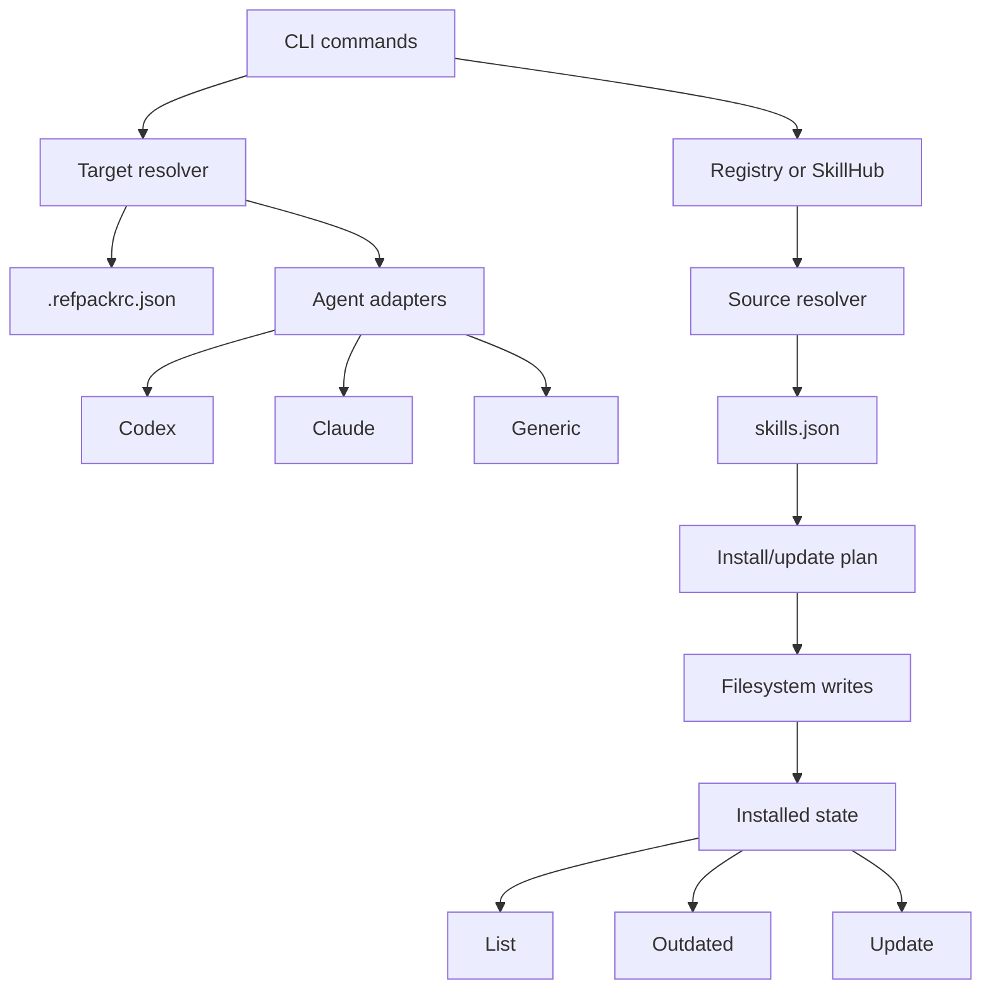
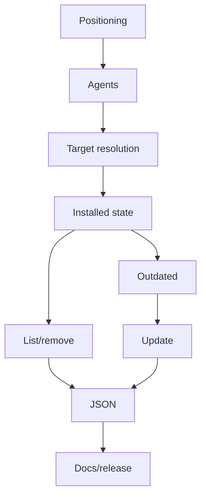

# feat: Build agent-aware skill manager v1

## Overview

Make `refpack` a team-first agent skill manager. v1 should install skills into explicit or detected agent targets, track installed state, report outdated skills, update safely, expose machine-readable state, and document a production-ready team workflow.

The implementation extends the current CLI, registry, source provider, install plan, diff, filesystem installer, and SkillHub patterns. It does not add marketplace, auth, signatures, Web UI, generic non-skill assets, or automatic agent config mutation.

## Requirements Trace

- R1-R4. Reposition around team-managed agent skills and controlled SkillHub distribution.
- R5-R10. Detect Codex and Claude targets, support Generic custom targets, add `--agent`, and keep detection advisory.
- R11-R13. Record installed metadata, distinguish managed/unmanaged skills, and keep remove synchronized.
- R14-R15. Add `outdated` and `update` lifecycle commands.
- R16-R19. Detect local edits, block update conflicts by default, and advance state only after successful writes.
- R20-R21. Add JSON output for agent/lifecycle state and preserve scriptable non-interactive behavior.
- R22-R23. Document team workflows, format boundaries, migration notes, and release readiness.

## Scope Boundaries

- No public marketplace, ratings, installs count, users, orgs, auth, private registry permissions, or database-backed SkillHub.
- No remote publish command; keep local pack, validate, and controlled deployment workflows.
- No signature/provenance trust chain in v1; document that integrity verifies bytes, not publisher identity.
- No automatic Codex, Claude, MCP, or runtime config mutation.
- No three-way merge for edited skills; block by default and allow explicit overwrite.
- No Web UI.
- No replacement of `skills.json` with a generic manifest.

## Existing Patterns

- CLI entry and command delegation: `src/cli.ts`, `src/commands/*`
- Config and raw target resolution: `src/config.ts`
- Install orchestration: `src/flow/install-flow.ts`
- Install planning and overwrite guard: `src/install/plan.ts`
- Filesystem writes/removal: `src/install/filesystem-installer.ts`
- File diff rendering: `src/install/diff.ts`
- Registry parsing and lookup: `src/registry/*`
- SkillHub projection and artifact validation: `src/skillhub/*`, `src/source/http-archive-provider.ts`
- Real process coverage: `test/cli-smoke.test.ts`, `test/skillhub-cli-smoke.test.ts`
- Docs to revise: `README.md`, `docs/skill-pack-format.md`, `docs/registry-format.md`, `docs/skillhub.md`

## Decisions

| Decision | Reason |
|---|---|
| Add an agent adapter layer | Codex, Claude, and Generic target behavior should not be duplicated in every command. |
| Keep `--target` highest precedence | CI and advanced users need deterministic raw paths. |
| Make `--agent` explicit | Detection should help selection, not silently authorize writes. |
| Generic requires explicit target/config | There is no safe generic auto-detection. |
| Store installed state near the managed target | Lifecycle commands operate on target state, not only project config. |
| Record per-file hashes | Update conflict detection needs local edit awareness. |
| Reuse install/source/diff pieces, not destructive overwrite order | Update must finish conflict checks before delete/replace operations. |
| Start outdated with version equality | Semver can wait until metadata needs it. |
| Add JSON only for state commands first | `agents`, `list`, `outdated`, and update preview are the automation-critical surfaces. |

## Success Metrics

- A documented flow works from `refpack init --agent <id>` through add, list, outdated, update dry-run, update, and remove.
- `agents`, `list`, `outdated`, and update preview emit parseable JSON.
- Locally edited installed files block update by default and remain byte-for-byte unchanged.
- SkillHub-hosted update still verifies artifact size and SHA-256 before manifest parsing.
- README and docs clearly define `refpack` as a team-first agent skill manager and name v1 non-goals.

## Deferred Implementation Decisions

- Exact Codex and Claude target rules: verify against local installations and current docs while implementing adapters.
- Exact installed-state filename/location: choose a hidden or reserved location that cannot be mistaken for a skill.
- Exact JSON field names: keep stable enough to document for v1.
- Missing/deleted local files during update: decide whether v1 treats them as conflicts or repairable drift, then test that behavior.

## Delivery Phases

1. **Product and Targeting Foundation:** Units 1-2.
2. **Shared Target and Installed State:** Units 3-4.
3. **Lifecycle Commands:** Units 5-7.
4. **Automation and v1 Hardening:** Units 8-9.

## Technical Shape

> *Directional only. Implementers should follow local code patterns, not copy this as code.*

## Implementation Units

- [ ] **Unit 1: Refocus product positioning**

**Goal:** Align docs and package metadata around team-first agent skill management.

**Requirements:** R1-R4, R22-R23

**Files:**
- Modify: `README.md`
- Modify: `package.json`
- Modify: `docs/skill-pack-format.md`
- Modify: `docs/skillhub.md`
- Test: `test/skillhub-examples.test.ts`

**Approach:**
- Lead with team skill management and controlled distribution.
- State that v1 focuses on agent skills and keeps broader context packs out of scope.
- Keep `skills.json` as the v1 manifest contract.
- Clarify SkillHub as controlled read-only distribution, not marketplace/trust authority.

**Test scenarios:**
- Existing SkillHub example catalog still parses and projects.
- No unit tests for prose-only changes unless fixtures change.

**Verification:** README explains product identity and v1 non-goals in the opening sections.

- [ ] **Unit 2: Add agent detection**

**Goal:** Detect/report Codex, Claude, and Generic target candidates without writing files.

**Requirements:** R5-R6, R9-R10, R20-R21

**Files:**
- Create: `src/agents/types.ts`
- Create: `src/agents/codex.ts`
- Create: `src/agents/claude.ts`
- Create: `src/agents/generic.ts`
- Create: `src/agents/index.ts`
- Create: `src/commands/agents.ts`
- Modify: `src/cli.ts`
- Test: `test/agents.test.ts`
- Test: `test/agents-cli-smoke.test.ts`

**Approach:**
- Model adapter id, display name, detection signals, candidate target, status, writeability, and notes.
- Treat command/directory detection as evidence, not authorization.
- Generic reports custom target support but resolves no target unless `--target` or config exists.
- `refpack agents` reports human-readable status; JSON behavior is finalized in Unit 8.

**Test scenarios:**
- Codex/Claude directories present -> available candidate targets.
- CLI present but target missing -> partial detection status.
- Parent exists, target missing -> creatable status when write checks allow.
- Generic without target -> no resolved writable target.
- Non-writable target -> per-agent not-writable status, command still succeeds.
- CLI smoke shows Codex, Claude, Generic entries.

**Verification:** Discovery has no skill-file side effects.

- [ ] **Unit 3: Centralize target resolution**

**Goal:** Resolve effective target consistently across lifecycle commands.

**Requirements:** R7-R8, R10, R21

**Dependencies:** Unit 2

**Files:**
- Modify: `src/config.ts`
- Modify: `src/commands/init.ts`
- Modify: `src/commands/add.ts`
- Modify: `src/commands/list.ts`
- Modify: `src/commands/remove.ts`
- Modify: `src/commands/info.ts`
- Modify: `src/cli.ts`
- Test: `test/config.test.ts`
- Test: `test/cli-smoke.test.ts`

**Approach:**
- Target precedence: `--target`, then `--agent`, then config target.
- Config may store selected agent id plus resolved target.
- `init` can choose detected targets interactively; non-interactive commands remain explicit.
- Existing raw `--target` behavior remains backward-compatible.

**Test scenarios:**
- `--target` overrides configured target/agent.
- `--agent codex` resolves Codex candidate when available.
- `init --agent claude` saves target and agent metadata.
- Existing config with only target still works.
- Unknown agent id -> clear `UserError`.
- No target/agent/config in non-interactive command -> missing target error.

**Verification:** add/list/remove share one target resolution path.

- [ ] **Unit 4: Add installed state**

**Goal:** Record managed installs and file hashes for lifecycle commands.

**Requirements:** R11, R16, R19

**Dependencies:** Unit 3

**Files:**
- Create: `src/state/types.ts`
- Create: `src/state/schema.ts`
- Create: `src/state/store.ts`
- Create: `src/state/files.ts`
- Modify: `src/flow/install-flow.ts`
- Modify: `src/install/filesystem-installer.ts`
- Test: `test/state.test.ts`
- Test: `test/filesystem-installer.test.ts`
- Test: `test/cli-smoke.test.ts`

**Approach:**
- Store state near the managed target.
- Use a metadata location/name directory scans ignore and cannot confuse with a skill.
- Record skill id, relative target, source, registry id when available, version, artifact metadata, agent id, installed time, and per-file hashes.
- Write state only after filesystem install succeeds.
- Treat missing state as empty; malformed state as a user-facing recovery error.

**Test scenarios:**
- Registry install writes source/version/target/file hashes.
- Direct local install writes source with no registry id.
- Overwrite install replaces only affected skill state.
- Missing state -> empty managed state.
- Metadata file in target root is not listed as unmanaged skill.
- Malformed state -> recovery-oriented error.
- Escaping target path in state -> rejected.

**Verification:** State never advances after failed file copy.

- [ ] **Unit 5: Make list/remove state-aware**

**Goal:** Show managed state and remove state entries with files.

**Requirements:** R12-R13, R20-R21

**Dependencies:** Unit 4

**Files:**
- Modify: `src/commands/list.ts`
- Modify: `src/commands/remove.ts`
- Modify: `src/install/filesystem-installer.ts`
- Test: `test/list.test.ts`
- Test: `test/remove.test.ts`
- Test: `test/cli-smoke.test.ts`

**Approach:**
- `list` prefers installed state and labels unmanaged directories.
- Targets without state keep understandable directory-list behavior.
- `remove` deletes files, then removes state only after filesystem success.
- Stale state with missing directory is visible.

**Test scenarios:**
- Managed list shows id/version/agent/source summary.
- Remove deletes skill directory and state entry.
- Unmanaged directory beside managed skill is labeled.
- State exists but directory missing -> stale/missing report.
- Remove filesystem failure -> state unchanged.
- CLI smoke covers add -> list -> remove -> list.

**Verification:** Managed and unmanaged entries are distinguishable.

- [ ] **Unit 6: Add outdated**

**Goal:** Compare installed versions with configured registry or SkillHub latest metadata.

**Requirements:** R14, R20-R21

**Dependencies:** Unit 5

**Files:**
- Create: `src/commands/outdated.ts`
- Create: `src/lifecycle/outdated.ts`
- Modify: `src/cli.ts`
- Modify: `src/registry/client.ts`
- Test: `test/outdated.test.ts`
- Test: `test/outdated-cli-smoke.test.ts`

**Approach:**
- Use installed state to find registry-backed entries.
- Compare installed version with registry latest version when available.
- Report `current`, `outdated`, `unknown-version`, `missing-source`, and unmanaged/ignored states.
- Start with equality comparison; defer semver ordering unless needed.

**Test scenarios:**
- Installed `1.0.0`, registry `1.1.0` -> outdated.
- Installed equals latest -> current.
- No installed version -> unknown version.
- Registry entry missing -> missing source report.
- Registry unavailable -> actionable error or unknown status.
- SkillHub projected registry update -> outdated.

**Verification:** `outdated` is read-only.

- [ ] **Unit 7: Add conflict-safe update**

**Goal:** Update managed skills without overwriting local edits by default.

**Requirements:** R15-R19, R21

**Dependencies:** Unit 6

**Files:**
- Create: `src/commands/update.ts`
- Create: `src/lifecycle/update.ts`
- Create: `src/lifecycle/conflicts.ts`
- Modify: `src/cli.ts`
- Modify: `src/flow/install-flow.ts`
- Modify: `src/install/plan.ts`
- Modify: `src/install/diff.ts`
- Test: `test/update.test.ts`
- Test: `test/update-cli-smoke.test.ts`
- Test: `test/skillhub-cli-smoke.test.ts`

**Approach:**
- Resolve update candidates from installed state and latest registry metadata.
- Reuse source resolution, manifest parsing, planning, dry-run, diff, and confirmation where safe.
- Compare recorded file hashes with current files before writes.
- Block conflicts unless overwrite is explicit.
- Stage new content and complete conflict checks before delete/replace.
- Avoid current overwrite path if it removes a directory before safety is proven; use update-specific replacement or backup/restore.
- Refresh state only after successful filesystem update.

**Test scenarios:**
- Update one skill from `1.0.0` to `1.1.0` updates files and state.
- `update --all` updates multiple outdated skills.
- `--dry-run` writes no files or state.
- `--diff` shows file changes.
- Current skill -> no-op.
- Locally modified file -> conflict, no writes, byte-for-byte unchanged.
- Locally deleted file -> explicit conflict or repair behavior.
- Artifact integrity mismatch -> abort, old state remains.
- Filesystem copy failure -> old state remains and recovery guidance appears.
- SkillHub-hosted update verifies size and integrity.

**Verification:** Update cannot silently overwrite local edits.

- [ ] **Unit 8: Add JSON output**

**Goal:** Make core state commands consumable by agents and CI.

**Requirements:** R20-R21

**Dependencies:** Units 2, 5, 6, 7

**Files:**
- Create: `src/output/json.ts`
- Modify: `src/commands/agents.ts`
- Modify: `src/commands/list.ts`
- Modify: `src/commands/outdated.ts`
- Modify: `src/commands/update.ts`
- Modify: `src/cli.ts`
- Test: `test/json-output.test.ts`
- Test: `test/agents-cli-smoke.test.ts`
- Test: `test/outdated-cli-smoke.test.ts`
- Test: `test/update-cli-smoke.test.ts`

**Approach:**
- Add `--json` to `agents`, `list`, `outdated`, and update preview/result.
- JSON output must have no banners, colors, spinners, or prose.
- Keep top-level keys stable and minimal.
- Do not broaden JSON to every command in v1.

**Test scenarios:**
- `agents --json` parses and includes Codex/Claude/Generic.
- `list --json` parses and includes managed/unmanaged entries.
- `outdated --json` parses and includes status values.
- `update --dry-run --json` parses and includes planned changes/conflicts.
- Empty state emits valid empty arrays.
- Error path keeps stdout parseable/clean in JSON mode.

**Verification:** Tests parse JSON with `JSON.parse`.

- [ ] **Unit 9: Finish v1 docs and release readiness**

**Goal:** Make v1 usable by team users, skill authors, and SkillHub operators.

**Requirements:** R1-R4, R22-R23

**Dependencies:** Units 1-8

**Files:**
- Modify: `README.md`
- Modify: `docs/skill-pack-format.md`
- Modify: `docs/registry-format.md`
- Modify: `docs/skillhub.md`
- Create: `docs/agent-targets.md`
- Create: `docs/installed-state.md`
- Create: `docs/v1-release-checklist.md`
- Modify: `package.json`
- Test: `test/cli-smoke.test.ts`
- Test: `test/skillhub-cli-smoke.test.ts`
- Test: `test/package-smoke.test.ts`

**Approach:**
- Document user, author, and operator workflows separately.
- Document agent detection, no-config-mutation, installed state, conflict handling, outdated/update, and JSON output.
- Add migration notes from v0.1 raw target usage to v1 agent-aware usage.
- Add npm package smoke coverage if practical in Vitest.

**Test scenarios:**
- Packed CLI can print version/help.
- Documented quickstart has equivalent smoke coverage.
- SkillHub docs align with hosted install/update smoke tests.

**Verification:** A team can follow docs from skill authoring to hosted install and update.

## System-Wide Risks

| Risk | Mitigation |
|---|---|
| Agent detection writes to wrong location | Detection is advisory; writes require `--agent`, `--target`, config, or confirmation. |
| Codex/Claude conventions change | Verify during implementation and express uncertainty in statuses. |
| State file is mistaken for a skill | Use ignored metadata location/name and test scanning behavior. |
| State advances after failed writes | Write state only after filesystem success. |
| Update reuses destructive overwrite behavior | Add pre-write conflict checks and update-specific replace/backup behavior. |
| JSON output drifts | Limit v1 JSON surface and parse-test every supported command. |
| Product scope expands again | Keep docs and examples focused on team agent skills. |

## Sources

- Origin: `docs/brainstorms/2026-04-28-agent-aware-team-skill-manager-v1-requirements.md`
- Prior installer plan: `docs/plans/2026-04-27-001-feat-skills-installer-cli-plan.md`
- Prior SkillHub plan: `docs/plans/2026-04-27-002-feat-skillhub-mvp-plan.md`
- Code: `src/cli.ts`, `src/config.ts`, `src/flow/install-flow.ts`, `src/install/plan.ts`, `src/install/filesystem-installer.ts`, `src/skillhub/catalog/registry-projection.ts`
